# Data Design

The BizCore data design establishes a comprehensive multi-tenant database architecture that supports a complete SaaS platform for small and medium-sized enterprises (SMEs). The system manages business operations across storefronts, point-of-sale (POS) systems, inventory management, subscriptions, and digital content. Each entity maintains strict data isolation through tenantId fields, ensuring complete separation between different tenant businesses while maintaining referential integrity through primary and foreign keys. Normalization minimizes data redundancy, preventing inconsistencies in product pricing, inventory levels, customer information, and subscription states. This structured approach enables efficient conflict detection, role-based access control, subscription lifecycle management, and comprehensive audit logging across all business operations.

## Entity Relationship Diagram

### Interactive Mermaid Diagram

```mermaid
erDiagram
    USER ||--o{ TENANT : "owns"
    USER ||--o{ TENANT_USER : "assigned to"
    USER ||--o{ ACTIVITY_LOG : "creates"
    USER ||--o{ NOTIFICATION : "receives"
    USER ||--o{ ORDER_STATUS_HISTORY : "updates"
    USER ||--o{ ORDER : "creates"
    USER ||--o{ PAGE : "creates"
    USER ||--o{ PAGE_REVISION : "creates"
    USER ||--o{ PAGE_DESIGN_REVISION : "creates"
    USER ||--o{ PROJECT : "creates"
    USER ||--o{ TENANT_REGISTRATION : "initiates"
    
    TENANT ||--o{ TENANT_USER : "has"
    TENANT ||--o{ ACTIVITY_LOG : "logs"
    TENANT ||--o{ NOTIFICATION : "sends"
    TENANT ||--o{ CATEGORY : "has"
    TENANT ||--o{ PRODUCT : "has"
    TENANT ||--o{ CUSTOMER : "has"
    TENANT ||--o{ EMPLOYEE : "has"
    TENANT ||--o{ INGREDIENT : "has"
    TENANT ||--o{ INVENTORY_TRANSACTION : "tracks"
    TENANT ||--o{ MEDIA : "stores"
    TENANT ||--o{ ORDER : "contains"
    TENANT ||--o{ PAGE : "has"
    TENANT ||--o{ PAGE_DESIGN : "has"
    TENANT ||--o{ STOREFRONT_SETTINGS : "configures"
    TENANT ||--o{ SUBSCRIPTION : "subscribes"
    TENANT ||--o{ BILLING_PREFERENCE : "has"
    TENANT ||--o{ ADMIN_NOTIFICATION : "triggers"
    TENANT ||--o{ PLAN_UPGRADE_REQUEST : "requests"
    
    TENANT_USER ||--|| TENANT : "belongs to"
    TENANT_USER ||--|| USER : "links"
    
    ACTIVITY_LOG ||--o| TENANT : "logs"
    ACTIVITY_LOG ||--o| USER : "logs"
    
    NOTIFICATION ||--|| TENANT : "sent by"
    NOTIFICATION ||--o| USER : "to"
    
    CATEGORY ||--|| TENANT : "belongs to"
    CATEGORY ||--o{ PRODUCT : "contains"
    
    PRODUCT ||--|| TENANT : "belongs to"
    PRODUCT ||--o| CATEGORY : "in"
    PRODUCT ||--o{ PRODUCT_VARIANT : "has variants"
    PRODUCT ||--o{ PRODUCT_INGREDIENT : "uses"
    PRODUCT ||--o{ ORDER_ITEM : "ordered as"
    
    PRODUCT_VARIANT ||--|| PRODUCT : "variant of"
    PRODUCT_VARIANT ||--o{ VARIANT_INGREDIENT : "uses"
    PRODUCT_VARIANT ||--o{ ORDER_ITEM : "ordered as"
    
    PRODUCT_INGREDIENT ||--|| PRODUCT : "for"
    PRODUCT_INGREDIENT ||--|| INGREDIENT : "uses"
    
    VARIANT_INGREDIENT ||--|| PRODUCT_VARIANT : "for"
    VARIANT_INGREDIENT ||--|| INGREDIENT : "uses"
    
    INGREDIENT ||--|| TENANT : "belongs to"
    INGREDIENT ||--o{ INVENTORY_TRANSACTION : "tracked"
    INGREDIENT ||--o{ PRODUCT_INGREDIENT : "used in"
    INGREDIENT ||--o{ VARIANT_INGREDIENT : "used in"
    
    INVENTORY_TRANSACTION ||--|| TENANT : "belongs to"
    INVENTORY_TRANSACTION ||--|| INGREDIENT : "for"
    
    CUSTOMER ||--|| TENANT : "belongs to"
    CUSTOMER ||--o{ ORDER : "places"
    
    ORDER ||--|| TENANT : "belongs to"
    ORDER ||--o| CUSTOMER : "from"
    ORDER ||--o| USER : "user order"
    ORDER ||--o| EMPLOYEE : "processed by"
    ORDER ||--o{ ORDER_ITEM : "contains"
    ORDER ||--o{ ORDER_STATUS_HISTORY : "tracks"
    
    ORDER_ITEM ||--|| ORDER : "part of"
    ORDER_ITEM ||--|| PRODUCT : "product"
    ORDER_ITEM ||--o| PRODUCT_VARIANT : "variant"
    
    ORDER_STATUS_HISTORY ||--|| ORDER : "tracks"
    ORDER_STATUS_HISTORY ||--|| USER : "by"
    
    EMPLOYEE ||--|| TENANT : "works for"
    EMPLOYEE ||--o{ ORDER : "processes"
    EMPLOYEE ||--o{ POS_SESSION : "has"
    
    POS_SESSION ||--|| EMPLOYEE : "by"
    POS_SESSION ||--|| TENANT : "at"
    
    PAGE ||--o| TENANT : "belongs to"
    PAGE ||--|| USER : "created by"
    PAGE ||--o{ PAGE_REVISION : "has versions"
    
    PAGE_REVISION ||--|| PAGE : "version of"
    PAGE_REVISION ||--|| USER : "created by"
    
    PAGE_DESIGN ||--|| TENANT : "belongs to"
    PAGE_DESIGN ||--o{ PAGE_COMPONENT : "contains"
    PAGE_DESIGN ||--o{ PAGE_DESIGN_REVISION : "has versions"
    PAGE_DESIGN ||--o| SEO_SETTINGS : "has"
    
    PAGE_COMPONENT ||--|| PAGE_DESIGN : "part of"
    
    PAGE_DESIGN_REVISION ||--|| PAGE_DESIGN : "version of"
    PAGE_DESIGN_REVISION ||--o| USER : "created by"
    
    SEO_SETTINGS ||--|| PAGE_DESIGN : "for"
    
    STOREFRONT_SETTINGS ||--|| TENANT : "configures"
    
    MEDIA ||--|| TENANT : "stored by"
    
    PROJECT ||--|| USER : "created by"
    PROJECT ||--o{ CANVAS : "contains"
    
    CANVAS ||--|| PROJECT : "part of"
    
    PLAN ||--o{ SUBSCRIPTION : "subscribed to"
    
    SUBSCRIPTION ||--|| TENANT : "for"
    SUBSCRIPTION ||--|| PLAN : "subscribes to"
    SUBSCRIPTION ||--o{ INVOICE : "issued"
    SUBSCRIPTION ||--o{ PAYMENT : "paid via"
    SUBSCRIPTION ||--o{ USAGE_RECORD : "tracks"
    SUBSCRIPTION ||--o| PLAN_UPGRADE_REQUEST : "has pending"
    
    INVOICE ||--|| SUBSCRIPTION : "for"
    INVOICE ||--o| PAYMENT : "paid by"
    
    PAYMENT ||--|| SUBSCRIPTION : "for"
    PAYMENT ||--o{ INVOICE : "pays"
    PAYMENT ||--o| PLAN_UPGRADE_REQUEST : "for upgrade"
    
    USAGE_RECORD ||--|| SUBSCRIPTION : "tracks"
    
    BILLING_PREFERENCE ||--|| TENANT : "for"
    
    PLAN_UPGRADE_REQUEST ||--|| TENANT : "from"
    PLAN_UPGRADE_REQUEST ||--|| SUBSCRIPTION : "upgrades"
    PLAN_UPGRADE_REQUEST ||--o| PAYMENT : "payment for"
    
    ADMIN_NOTIFICATION ||--o| TENANT : "about"
    
    TENANT_REGISTRATION ||--|| USER : "by"
```



### ASCII Diagrams by Subsystem

#### 1. Core & Authentication System

```
                            ┌──────────────┐
                            │    Users     │
                            │──────────────│
                            │ id (PK)      │
                            │ email        │
                            │ role         │
                            │ password     │
                            │ isActive     │
                            └──────────────┘
                                ▲    ▲
                            ┌───┘    └──────────────────┐
                            │                          │
                    ┌───────┴────────┐      ┌──────────┴──────────┐
                    │                │      │                     │
            ┌───────────────────┐    │   ┌──────────────────┐   │
            │ Tenants           │    │   │ TenantUsers      │   │
            │───────────────────│    │   │──────────────────│   │
            │ id (PK)           │    │   │ id (PK)          │   │
            │ name              │    │   │ tenantId (FK)    │◄──┴─────┐
            │ subdomain         │    │   │ userId (FK)      │◄────────┤
            │ ownerId (FK)      │◄───┘   │ role             │         │
            │ logo              │        │ permissions      │         │
            │ isActive          │        └──────────────────┘         │
            │ isPremium         │                                    │
            │ subscriptionPlan  │        ┌──────────────────┐        │
            │ primaryColor      │        │ ActivityLogs     │        │
            │ secondaryColor    │        │──────────────────│        │
            └───────────────────┘        │ id (PK)          │        │
                    │                   │ userId (FK)      │────────┘
            ┌───────┴────────┐          │ tenantId (FK)    │
            │                │          │ action           │
            │                │          │ details          │
            │                │          │ createdAt        │
            │                │          └──────────────────┘
            │                │
            │                │          ┌──────────────────┐
            │                └─────────→│ Notifications    │
            │                           │──────────────────│
            │                           │ id (PK)          │
            │                           │ tenantId (FK)    │
            │                           │ type             │
            │                           │ message          │
            │                           └──────────────────┘

            ┌──────────────────┐       ┌──────────────────┐
            │ TenantRegistration       │ AdminNotification│
            │──────────────────│       │──────────────────│
            │ id (PK)          │       │ id (PK)          │
            │ userId           │       │ type             │
            │ email            │       │ tenantId         │
            │ businessName     │       │ message          │
            │ verificationToken│       │ isRead           │
            │ isVerified       │       └──────────────────┘
            └──────────────────┘

            ┌──────────────────┐
            │      OTP         │
            │──────────────────│
            │ id (PK)          │
            │ email            │
            │ otp              │
            │ userType         │
            │ expiresAt        │
            │ attempts         │
            └──────────────────┘
```

#### 2. Products & Catalog System

```
            ┌──────────────────┐       ┌────────────────────┐
            │   Categories     │       │      Products      │
            │──────────────────│       │────────────────────│
            │ id (PK)          │       │ id (PK)            │
            │ tenantId         │◄──────│ tenantId           │
            │ name             │       │ categoryId (FK)    │
            │ image            │       │ name               │
            │ isActive         │       │ price              │
            │ sortOrder        │       │ cost               │
            └──────────────────┘       │ image              │
                                       │ currentStock       │
                                       │ lowStockThreshold  │
                                       │ isActive           │
                                       │ isFeatured         │
                                       └────────────────────┘
                                              │
                          ┌────────────────────┼────────────────────┐
                          │                    │                    │
            ┌─────────────┴──────────┐  ┌──────┴─────────┐   ┌──────┴──────────┐
            │  ProductVariant        │  │ProductIngredient   │ OrderItem       │
            │────────────────────────│  │──────────────────│ │─────────────────│
            │ id (PK)                │  │ id (PK)          │ │ id (PK)         │
            │ productId              │  │ productId (FK)   │ │ orderId         │
            │ name                   │  │ ingredientId(FK) │ │ productId       │
            │ price                  │  │ quantity         │ │ variantId       │
            │ isActive               │  └──────────────────┘ │ quantity        │
            └────────────┬───────────┘           ▲            │ price           │
                         │                       │            └─────────────────┘
                         │                       │
            ┌────────────┴──────────┐       ┌────┴─────────────┐
            │ VariantIngredient     │       │   Ingredients    │
            │───────────────────────│       │──────────────────│
            │ id (PK)               │       │ id (PK)          │
            │ variantId (FK)        │       │ tenantId         │
            │ ingredientId (FK)     │───────│ name             │
            │ quantity              │       │ unit             │
            │ createdAt             │       │ currentStock     │
            └───────────────────────┘       │ minStock         │
                                            │ costPerUnit      │
                                            │ supplier         │
                                            │ isActive         │
                                            └──────────────────┘
```

#### 3. Orders & Fulfillment System

```
            ┌────────────────────┐        ┌──────────────────┐
            │     Customers      │        │      Orders      │
            │────────────────────│        │──────────────────│
            │ id (PK)            │────────│ id (PK)          │
            │ tenantId           │◄───────│ customerId (FK)  │
            │ firstName          │        │ userId (FK)      │
            │ lastName           │        │ tenantId         │
            │ email              │        │ orderNumber      │
            │ phone              │        │ status           │
            │ address            │        │ orderType        │
            │ isActive           │        │ total            │
            └────────────────────┘        │ tax              │
                                          │ discount         │
                                          │ paymentStatus    │
                                          │ employeeId (FK)  │
                                          │ deliveryAddress  │
                                          └────────┬─────────┘
                                                   │
                                    ┌──────────────┼──────────────┐
                                    │              │              │
                        ┌───────────┴─────┐   ┌───┴──────────┐   ┌┴─────────────────┐
                        │   OrderItem     │   │OrderStatusHis   │Media             │
                        │─────────────────│   │───────────────  │──────────────────│
                        │ id (PK)         │   │ id (PK)      │  │ id (PK)          │
                        │ orderId (FK)    │   │ orderId (FK) │  │ tenantId         │
                        │ productId (FK)  │   │ userId (FK)  │  │ filename         │
                        │ variantId (FK)  │   │ status       │  │ url              │
                        │ quantity        │   │ notes        │  │ type             │
                        │ price           │   │ createdAt    │  │ size             │
                        │ notes           │   └──────────────┘  │ alt              │
                        └─────────────────┘                     └──────────────────┘
```

#### 4. Inventory Management System

```
            ┌──────────────────┐
            │   Ingredients    │
            │──────────────────│
            │ id (PK)          │
            │ tenantId         │
            │ name             │
            │ unit             │
            │ currentStock     │
            │ minStock         │
            │ costPerUnit      │
            │ supplier         │
            │ isActive         │
            └────────┬─────────┘
                     │
                     │
            ┌────────┴─────────────────┐
            │ InventoryTransaction     │
            │──────────────────────────│
            │ id (PK)                  │
            │ tenantId                 │
            │ ingredientId (FK)        │
            │ type                     │
            │ quantity                 │
            │ reason                   │
            │ cost                     │
            │ performedBy              │
            │ createdAt                │
            └──────────────────────────┘
```

#### 5. Employees & POS System

```
            ┌──────────────────┐         ┌──────────────────┐
            │   Employees      │         │   POSSession     │
            │──────────────────│         │──────────────────│
            │ id (PK)          │         │ id (PK)          │
            │ tenantId         │────────→│ employeeId (FK)  │
            │ firstName        │         │ tenantId         │
            │ lastName         │         │ startTime        │
            │ email            │         │ endTime          │
            │ password         │         │ openingCash      │
            │ pin              │         │ closingCash      │
            │ role             │         │ expectedCash     │
            │ isActive         │         │ cashDifference   │
            │ permissions      │         │ totalSales       │
            └──────────────────┘         │ totalOrders      │
                                         │ notes            │
                                         │ isActive         │
                                         └──────────────────┘
```

#### 6. Storefront & Page Design System

```
            ┌────────────────────┐    ┌────────────────────┐
            │   PageDesign       │    │  PageComponent     │
            │────────────────────│    │────────────────────│
            │ id (PK)            │───→│ id (PK)            │
            │ tenantId           │    │ pageDesignId (FK)  │
            │ slug               │    │ componentType      │
            │ title              │    │ props              │
            │ content            │    │ position           │
            │ isPublished        │    └────────────────────┘
            │ publishedContent   │
            └────────┬───────────┘
                     │
            ┌────────┴──────────────────┐         ┌────────────────────┐
            │ PageDesignRevision        │         │  SeoSettings       │
            │──────────────────────────│         │────────────────────│
            │ id (PK)                  │         │ id (PK)            │
            │ pageDesignId (FK)        │◄────────│ pageDesignId (FK)  │
            │ content                  │         │ metaTitle          │
            │ revisionNumber           │         │ metaDescription    │
            │ changeDescription        │         │ metaKeywords       │
            │ createdBy (FK)           │         │ ogImage            │
            │ createdAt                │         │ canonicalUrl       │
            └──────────────────────────┘         └────────────────────┘

            ┌────────────────────┐     ┌────────────────────┐
            │      Page          │     │   PageRevision     │
            │────────────────────│     │────────────────────│
            │ id (PK)            │     │ id (PK)            │
            │ tenantId           │────→│ pageId (FK)        │
            │ userId             │     │ userId (FK)        │
            │ title              │     │ content            │
            │ slug               │     │ createdAt          │
            │ content            │     └────────────────────┘
            │ isPublished        │
            └────────────────────┘

            ┌────────────────────┐     ┌────────────────────┐
            │    Project         │     │      Canvas        │
            │────────────────────│     │────────────────────│
            │ id (PK)            │────→│ id (PK)            │
            │ userId             │     │ projectId (FK)     │
            │ name               │     │ data               │
            │ tenantId           │     │ createdAt          │
            └────────────────────┘     └────────────────────┘

            ┌──────────────────────────┐
            │ StorefrontSettings       │
            │──────────────────────────│
            │ id (PK)                  │
            │ tenantId                 │
            │ colorScheme              │
            │ typography               │
            │ brandAssets              │
            │ seoDefaults              │
            │ socialLinks              │
            │ paymentMethods           │
            │ shippingSettings         │
            └──────────────────────────┘
```

#### 7. Subscription & Billing System

```
            ┌──────────────────┐         ┌──────────────────┐
            │     Plans        │         │  Subscription    │
            │──────────────────│         │──────────────────│
            │ id (PK)          │────────→│ id (PK)          │
            │ name             │         │ tenantId         │
            │ description      │         │ planId (FK)      │
            │ price            │         │ status           │
            │ billingCycle     │         │ billingCycle     │
            │ features         │         │ renewalDate      │
            │ isActive         │         │ autoRenew        │
            └──────────────────┘         └────────┬─────────┘
                                                  │
                                   ┌──────────────┼──────────────┐
                                   │              │              │
                        ┌──────────┴──┐  ┌────────┴────────┐  ┌──┴──────────┐
                        │   Invoices   │  │   Payments      │  │UsageRecords │
                        │──────────────│  │─────────────────│  │─────────────│
                        │ id (PK)      │  │ id (PK)         │  │ id (PK)     │
                        │subscriptionId│  │subscriptionId   │  │subscription │
                        │invoiceNumber │  │status           │  │metric       │
                        │status        │  │amount           │  │value        │
                        │total         │  │currency         │  │limit        │
                        │dueDate       │  │paymentMethod    │  │recordedAt   │
                        │paidAt        │  │gatewayId        │  └─────────────┘
                        │lineItems     │  │retryCount       │
                        └──────┬───────┘  │metadata         │
                               │          └─────────────────┘
                               │                 ▲
                               │                 │
                               └─────────────────┘

            ┌──────────────────────────┐
            │ PlanUpgradeRequest       │
            │──────────────────────────│
            │ id (PK)                  │
            │ tenantId                 │
            │ currentPlan              │
            │ newPlan                  │
            │ status                   │
            │ amountDue                │
            │ prorationDetails         │
            │ paymentId                │
            │ requestedAt              │
            └──────────────────────────┘

            ┌──────────────────────────┐
            │ BillingPreference        │
            │──────────────────────────│
            │ id (PK)                  │
            │ tenantId                 │
            │ notifyBeforeRenewal      │
            │ billingEmail             │
            │ billingAddress           │
            │ taxId                    │
            │ autoRenew                │
            │ gcashPhoneNumber         │
            │ gcashQrCodeUrl           │
            └──────────────────────────┘

            ┌──────────────────────────┐
            │  AdminSettings           │
            │──────────────────────────│
            │ id (PK)                  │
            │ adminGcashPhoneNumber    │
            │ adminGcashAccountName    │
            │ adminGcashQrCodeUrl      │
            └──────────────────────────┘
```

## Entity Descriptions

### 1. **Users**
Oversees all user accounts in the system, including administrators, tenant owners, and BrandStudio project managers. Stores authentication credentials, verification tokens, security parameters such as login attempts and account locks, and email verification status. Maintains relationships with tenants as owners, tenant user assignments, activity logs, notifications, orders, and page designs. Enables multi-tenant user management with role-based access control (Admin, Tenant Owner, Tenant User, User).

### 2. **Tenants**
Represents individual business accounts (SaaS customers) in BizCore. Each tenant operates in isolation with unique subdomains and domains, managing products, customers, employees, and orders independently. Stores branding information including logos, primary/secondary colors, custom CSS, and Google Analytics/Facebook Pixel tracking codes. Tracks subscription status, billing plans (Free, Basic, Premium, Enterprise), and premium feature access. Maintains relationships with all tenant-specific data including categories, products, customers, employees, orders, pages, and activity logs.

### 3. **TenantUsers**
Manages the relationship between users and tenants, defining which users have access to which tenant accounts and their roles (Owner, Admin, Editor, Viewer). Enforces unique user-per-tenant assignments preventing duplicate access. Stores custom permissions as JSON for granular access control within the tenant context.

### 4. **ActivityLogs**
Tracks all user actions within each tenant for audit trails and compliance. Records user identifiers, tenant context, action descriptions, detailed metadata, IP addresses, and user agent information. Enables investigation of data changes, security incidents, and operational analytics by maintaining a complete historical record of system interactions.

### 5. **Notifications**
Delivers system messages to users for order updates, subscription events, admin alerts, and business notifications. Classifies notifications by type and priority (low, medium, high), tracks read/archived status, and supports action URLs for direct navigation. Maintains tenant isolation ensuring users only receive notifications relevant to their accounts.

### 6. **Categories**
Organizes products into logical groupings for storefront navigation and inventory management. Stores category names, descriptions, images, and display order for customizable product organization. Supports multi-tenant category management where each tenant maintains independent product hierarchies.

### 7. **Products**
Core inventory items available for sale through storefronts and POS systems. Maintains product metadata including names, descriptions, pricing (selling and cost), images, and stock information (current stock, low stock thresholds). Tracks product status (active/inactive, featured), relationships to categories, variants, and ingredients. Supports inventory tracking with optional SKU/slug identifiers for product lookup.

### 8. **ProductVariants**
Represents variations of a single product (e.g., sizes, colors, styles) with independent pricing. Links to parent products and maintains separate ingredient requirements for each variant. Enables flexible product offerings where base products have multiple purchasable options with variant-specific costs.

### 9. **Ingredients**
Raw materials or components used in product preparation and assembly. Tracks ingredient names, descriptions, units (pieces, grams, liters), current and minimum stock levels, supplier information, and per-unit costs. Maintains reserved stock for pending orders and relationships to products and variants for recipe/composition tracking. Essential for inventory management and product cost calculations.

### 10. **ProductIngredients**
Defines the composition of products by linking products to required ingredients and quantities. Enforces unique product-ingredient combinations preventing duplicate recipes. Enables cost calculations, inventory consumption tracking, and recipe management across the product catalog.

### 11. **VariantIngredients**
Specifies ingredient requirements for individual product variants, allowing different variants to require different ingredient quantities or combinations. Manages the relationship between product variants and ingredients with specific quantity requirements for accurate inventory and cost tracking.

### 12. **InventoryTransactions**
Records all inventory movements including stock additions (purchases, production), reductions (sales, spoilage), and adjustments. Tracks transaction type, quantity, reason, cost, and the employee performing the transaction. Maintains complete audit trail for inventory discrepancies, cost analysis, and supply chain visibility.

### 13. **Customers**
Stores information about retail customers who purchase through storefronts. Maintains contact details (email, phone), delivery addresses, account status, and verification. Supports customer authentication with passwords and password resets. Tracks customer engagement metrics (last login, creation date) for relationship management and CRM functionality.

### 14. **Orders**
Records all customer purchases across storefronts, delivery, and dine-in channels. Tracks order lifecycle including status progression (pending, confirmed, preparing, ready, completed), payment status, and fulfillment details. Maintains financial information (total, tax, discount, payment method), customer assignment, delivery address, and employee responsibility for POS orders. Relationships connect orders to customers, line items, and status history for complete order tracking.

### 15. **OrderItems**
Details individual product lines within orders, linking products and variants with quantities and prices. Supports item-level notes for special requests or modifications. Enables accurate order fulfillment, revenue calculations, and inventory consumption tracking.

### 16. **OrderStatusHistory**
Maintains audit trail of order status changes with timestamps, responsible users, and transition notes. Enables tracking of order progression, identifying bottlenecks in fulfillment, and providing customers visibility into order processing.

### 17. **Employees**
Represents POS system staff with authentication credentials (email/password and PIN for quick login), roles (Cashier, Manager, Admin), and activity tracking. Stores custom permissions for role-based access within POS. Maintains employee status and relationships to orders they process and POS sessions they manage.

### 18. **POSSession**
Records POS terminal sessions initiated by employees, tracking start/end times, opening/closing cash amounts, expected vs. actual cash, total sales, and number of transactions. Enables cash reconciliation, accountability for transactions, and shift-based reporting for POS operations.

### 19. **Pages**
User-created content pages in the BrandStudio (custom page builder) that tenants publish as part of their storefront. Stores page metadata (title, slug), content JSON, publication status, and creation/update timestamps. Supports multiple user creators and maintains relationships to revisions for version control.

### 20. **PageRevisions**
Tracks version history of pages, storing previous content states with revision metadata and creator information. Enables rollback to previous versions if needed and audit trail of content changes.

### 21. **PageDesign**
Represents designed storefront pages created through the BrandStudio visual designer with Konva canvas components. Stores page templates, component structure as JSON, and separate published/draft versions. Tracks design status (published/draft), publication timestamps, and relationships to components and SEO settings for storefront page management.

### 22. **PageComponent**
Individual components placed on page designs (hero sections, product galleries, testimonials, CTAs, etc.) with customizable props. Maintains component type, position/order, and configuration data. Enables modular page construction through reusable, configurable components.

### 23. **PageDesignRevision**
Version control for page designs storing previous design states, revision numbers, change descriptions, creator, and timestamps. Enables design iteration and rollback capabilities.

### 24. **SeoSettings**
SEO metadata for page designs including meta titles, descriptions, keywords, Open Graph images, Twitter Card data, and canonical URLs. Improves search engine visibility and social sharing presentation for published pages.

### 25. **StorefrontSettings**
Tenant-wide storefront configuration including color schemes, typography, brand assets, SEO defaults, social links, payment methods, and shipping settings. Provides centralized customization for storefront appearance and behavior without code changes.

### 26. **Plans**
Subscription plan definitions (Free, Basic, Premium, Enterprise) with pricing, billing cycles, included features, and display order. Admins manage plan offerings, activation status, and feature lists. Enables flexible subscription tiers with different capabilities.

### 27. **Subscription**
Active subscription instances for each tenant, tracking enrollment in specific plans with status (trial, active, paused, overdue, cancelled). Maintains billing periods, renewal dates, automatic renewal settings, unused balance for prorations, and pending upgrade information. Relationships to invoices, payments, and usage records provide complete billing lifecycle tracking.

### 28. **Invoices**
Billing documents for subscription charges with line items, subtotals, taxes, discounts, and payment due dates. Tracks invoice status (issued, paid, failed, refunded) and payment records. Provides financial records for accounting and customer reference.

### 29. **Payments**
Payment transaction records with status tracking (unpaid, partial, paid, refunded), payment method details (card brand, last four digits), gateway integration information, and retry logic. Stores idempotency keys for duplicate prevention, error messages for failures, and expiration/verification timestamps. Enables payment reconciliation, failure handling, and audit trails.

### 30. **UsageRecords**
Tracks consumption of metered subscription features (API calls, user seats, storage, etc.) against plan limits. Records metric values, limits, and percentage of limit used for overage detection and upgrade triggers.

### 31. **BillingPreference**
Tenant billing configuration including renewal notifications, billing contacts, email addresses, auto-renewal settings, and payment method preferences. Stores GCash payment details for Philippine market support (account names, phone numbers, QR codes).

### 32. **PlanUpgradeRequest**
Captures plan upgrade requests from tenants with old/new plan details, prorated amounts, and multi-stage workflow (pending → payment_submitted → approved → applied). Tracks approval details, expiration dates, and linked payment records for upgrade transaction management.

### 33. **AdminSettings**
Global system configuration for administrators including GCash payment gateway credentials (phone numbers, account names, QR codes) for receiving payments.

### 34. **TenantRegistration**
Captures new tenant registration information during signup with business details (business name, industry, description), email address, and verification status. Stores verification tokens with expiration for email validation. Enables controlled onboarding with email verification requirements.

### 35. **AdminNotification**
Alerts for system administrators about critical events including new tenant registrations, subscription changes, payment failures, and account issues. Tracks notification type, read status, and dismissal status enabling focused admin dashboard management.

### 36. **OTP**
One-Time Password records for multi-factor authentication flows supporting different user types (tenant, admin, employee). Stores generated OTPs with expiration times and failed attempt counts to enforce rate limiting on OTP verification.

### 37. **Media**
Digital asset storage metadata for images, PDFs, and other files uploaded by tenants. Tracks filenames, storage paths, access URLs, file types, sizes, and alt text for accessibility. Maintains relationships to tenants enabling organized media management per business.

### 38. **Project & Canvas**
Support BrandStudio canvas-based design interface where users create visual page layouts. Projects organize multiple canvas designs, enabling batch design management for storefronts and marketing pages.

---

## Data Relationships & Integrity

The BizCore database maintains referential integrity through foreign key constraints ensuring:

- **Multi-tenancy isolation**: Every entity except global system tables includes `tenantId` for complete data separation
- **User authentication integrity**: Unique email constraints prevent duplicate accounts; password reset tokens enable secure recovery
- **Order fulfillment**: Order items cascade with order deletion; status history tracks fulfillment progression
- **Inventory consistency**: Product stock updates via transactions; ingredient reservations prevent overselling
- **Subscription lifecycle**: Payment records link to invoices and upgrades for complete billing audit trail
- **Content versioning**: Page revisions and design revisions maintain rollback capability
- **Access control**: TenantUser assignments with role-based permissions enforce authorization

Normalization eliminates redundancy by separating concerns across specialized entities (Ingredients, Variants, Components, etc.) while maintaining referential consistency that prevents orphaned or invalid records. This structured design ensures BizCore maintains data reliability, enables secure multi-tenancy, and provides administrators and tenants dependable outputs for business operations.
